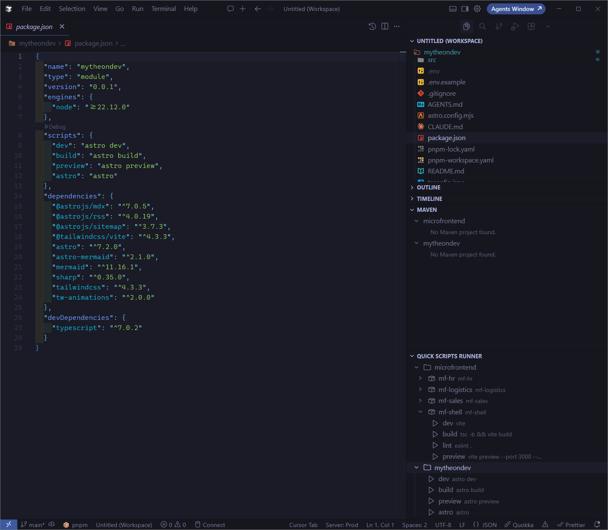

# Quick Scripts Runner


> Execute `package.json` scripts with a single click from the sidebar, featuring automatic package manager detection.

The ultimate Visual Studio Code extension for running npm, pnpm, yarn, and bun scripts directly from the explorer sidebar. No more switching to terminal or remembering command syntax—just click and run.

[VS Marketplace](https://marketplace.visualstudio.com/) • [Features](#-features) • [Usage](#-usage) • [Configuration](#%EF%B8%8F-configuration) • [Multi-Workspace](#-multi-workspace-support)

---

## ✨ Features

### 🎯 Core Functionality

- **📋 Scripts Sidebar View**: A dedicated "Quick Scripts Runner" panel in the Explorer view that displays all available scripts from your `package.json`
- **📂 Nested Packages**: Discovers `package.json` files in subfolders (monorepos, microfrontends) and lists each package's scripts
- **🚀 One-Click Execution**: Execute any script with a single click—no terminal commands needed
- **🔍 Automatic Package Manager Detection**: Intelligently detects your package manager (npm, pnpm, yarn, bun) based on lock files, walking up from nested packages when needed
- **🔄 Auto-Refresh**: Automatically updates the scripts list when `package.json` or lock files change
- **📊 Status Bar Indicator**: Visual indicator in the status bar showing the current package manager
- **📁 Multi-Workspace Support**: Works seamlessly with multiple workspace folders, showing scripts hierarchically

### 🎨 User Experience

- **🎯 Smart Workspace Detection**: Automatically shows scripts from the active workspace based on your current editor
- **💻 Terminal Reuse**: Reuses existing terminals for the same script, keeping your workspace organized
- **📝 Script Preview**: Hover over scripts to see the full command in tooltips
- **⚡ Quick Actions**: Access common actions directly from the view title bar
- **🎨 Intuitive Icons**: Visual indicators for each package manager and script type

## 📸 Screenshots



The extension adds a new "Quick Scripts Runner" section in the explorer sidebar, displaying all available scripts from your `package.json`. Nested packages are grouped as package nodes; a workspace with a single root `package.json` still shows scripts directly.

## 🚀 Installation

### From VS Code Marketplace

1. Open VS Code
2. Press `Ctrl+Shift+X` (or `Cmd+Shift+X` on Mac) to open Extensions
3. Search for **"Quick Scripts Runner"**
4. Click **Install**

Or install via command line:

```bash
code --install-extension alckordev.quick-scripts-runner
```

### From Cursor

Cursor indexes extensions from [Open VSX](https://open-vsx.org/), not the VS Code Marketplace.

1. Open Cursor
2. Press `Ctrl+Shift+X` (or `Cmd+Shift+X` on Mac) to open Extensions
3. Search for **"Quick Scripts Runner"** (`alckordev.quick-scripts-runner`)
4. Click **Install**

If the listing does not appear immediately after a new release, reload the window (`Developer: Reload Window`) and search again after Open VSX has been indexed.

### From Source

1. Clone this repository
2. Open the folder in VS Code
3. Run `pnpm install`
4. Press `F5` to open a new VS Code window with the extension loaded

## 📖 Usage

### Executing Scripts

#### Method 1: From Sidebar

1. Open the Explorer sidebar (View → Explorer or `Ctrl+Shift+E`)
2. Locate the **"Quick Scripts Runner"** section
3. Click on any script to execute it
4. The script runs in an integrated terminal with the correct package manager

#### Method 2: From Command Palette

1. Press `Ctrl+Shift+P` (or `Cmd+Shift+P` on Mac)
2. Type "Quick Scripts Runner: Run Script"
3. Select the script from the list (nested packages appear with their relative path as detail)

Each script runs in an integrated terminal whose working directory is the folder that contains that `package.json`. Terminals are reused per package + script, so `dev` in the workspace root and `dev` in a subpackage do not share a terminal.

#### Method 3: Right-Click Context Menu

- Right-click on any script in the Quick Scripts Runner view
- Select "Run Script" from the context menu
- Right-click a package or script and choose **Open package.json** to edit that package's file

### Refreshing Scripts

The scripts list automatically refreshes when:

- `package.json` is modified
- Lock files are created, modified, or deleted
- Workspace folders are added or removed

**Manual Refresh**:

- Click the refresh button (🔄) in the Quick Scripts Runner view title bar
- Or use the command: `Quick Scripts Runner: Refresh Scripts` (`Ctrl+Shift+P`)

### Changing Package Manager

#### Method 1: From View Title Bar

1. Click the package manager button (📦) in the Quick Scripts Runner view title bar
2. Select your desired package manager from the quick pick menu

#### Method 2: From Status Bar

1. Click on the package manager indicator in the status bar (bottom-left)
2. Select your desired package manager

#### Method 3: From Settings

1. Open VS Code Settings (`Ctrl+,`)
2. Search for "Quick Scripts Runner"
3. Set `quickScriptsRunner.defaultPackageManager` to your preferred manager

**Note**: The extension will use your selection when auto-detection is disabled or when no lock files are found.

### Opening package.json

#### Method 1: From View Title Bar

- Click the file button (📄) in the Quick Scripts Runner view title bar

#### Method 2: From Command Palette

- Press `Ctrl+Shift+P`
- Type "Quick Scripts Runner: Open package.json"
- Press Enter

#### Creating package.json

If `package.json` doesn't exist:

1. Use the "Open package.json" command
2. When prompted, click "Create"
3. A basic `package.json` template will be created with a sample script

## 📁 Nested Packages and Multi-Workspace Support

When working with nested `package.json` files or multiple workspace folders, Quick Scripts Runner organizes scripts as follows:

### Single Package (workspace root only)

- Scripts are displayed directly in the Quick Scripts Runner view
- No folder hierarchy needed

### Nested Packages (monorepos, microfrontends)

Example:

```
mytheondev/
  package.json          → root scripts (dev, build, …)
  microfrontend/
    mf-hr/package.json
    mf-logistics/package.json
    mf-sales/package.json
```

The view shows a package node for the root and one for each nested package (for example `mf-sales` with description `microfrontend/mf-sales`). Intermediate folders without a `package.json` are not listed. Each script runs with `cwd` set to its own package directory.

Disable this with `quickScriptsRunner.scanSubfolders` if you only want the workspace root.

### Multiple Workspaces

- Each workspace with scripts appears as a folder in the view
- Expand folders to see packages (or scripts, when the workspace has a single root package)
- The active workspace is automatically detected based on your current editor
- Status bar shows the package manager for the active workspace

### Workspace Detection Logic

1. **Active Editor**: If you have a file open, the workspace containing that file is considered active
2. **First Workspace**: If no file is open, the first workspace folder is used
3. **Hierarchical View**: All workspaces with scripts are shown as expandable folders

## ⚙️ Configuration

Customize Quick Scripts Runner through **Settings → Extensions → Quick Scripts Runner**:

### `quickScriptsRunner.defaultPackageManager`

Sets the default package manager when automatic detection is not possible or disabled.

| Setting | Type   | Default | Description                          |
| ------- | ------ | ------- | ------------------------------------ |
| Values  | string | `npm`   | One of: `npm`, `pnpm`, `yarn`, `bun` |
| Scope   |        |         | Workspace or User settings           |

**Example**:

```json
{
  "quickScriptsRunner.defaultPackageManager": "pnpm"
}
```

### `quickScriptsRunner.autoDetectPackageManager`

Enables or disables automatic package manager detection based on lock files.

| Setting | Type    | Default | Description                                                          |
| ------- | ------- | ------- | -------------------------------------------------------------------- |
| Values  | boolean | `true`  | When `true`, detects based on lock files; when `false`, uses default |
| Scope   |         |         | Workspace or User settings                                           |

**Example**:

```json
{
  "quickScriptsRunner.autoDetectPackageManager": false
}
```

### `quickScriptsRunner.scanSubfolders`

Enables recursive discovery of `package.json` files in subfolders.

| Setting | Type    | Default | Description                                        |
| ------- | ------- | ------- | -------------------------------------------------- |
| Values  | boolean | `true`  | When `true`, nested packages appear in the sidebar |
| Scope   |         |         | Workspace or User settings                         |

**Example**:

```json
{
  "quickScriptsRunner.scanSubfolders": true
}
```

### `quickScriptsRunner.exclude`

Glob patterns skipped while scanning nested `package.json` files.

| Setting | Type           | Default                                                                                            | Description       |
| ------- | -------------- | -------------------------------------------------------------------------------------------------- | ----------------- |
| Values  | array of globs | `["**/node_modules/**", "**/.git/**", "**/dist/**", "**/out/**", "**/.next/**", "**/coverage/**"]` | Paths to ignore   |
| Scope   |                |                                                                                                    | Workspace or User |

**Example**:

```json
{
  "quickScriptsRunner.exclude": ["**/node_modules/**", "**/.git/**", "**/dist/**", "**/vendor/**"]
}
```

### `quickScriptsRunner.maxResults`

Maximum number of `package.json` files to include when scanning subfolders. Prevents very large workspaces from stalling the tree view.

| Setting | Type   | Default | Description                |
| ------- | ------ | ------- | -------------------------- |
| Values  | number | `50`    | Must be at least `1`       |
| Scope   |        |         | Workspace or User settings |

**Example**:

```json
{
  "quickScriptsRunner.maxResults": 80
}
```

### Detection Priority

When auto-detection is enabled, the extension checks for lock files in the package directory, then walks up to the workspace root, in this order:

1. `pnpm-lock.yaml` → **pnpm**
2. `yarn.lock` → **yarn**
3. `bun.lock` or `bun.lockb` → **bun**
4. `package-lock.json` → **npm**
5. No lock file found → Uses `quickScriptsRunner.defaultPackageManager`

## 🎨 Supported Use Cases

Quick Scripts Runner works with any project that has a `package.json`, regardless of the technology stack:

### Frontend Frameworks

- ✅ **React** - `npm run start`, `npm run build`, etc.
- ✅ **Vue.js** - `npm run serve`, `npm run build`
- ✅ **Angular** - `ng serve`, `ng build`
- ✅ **Next.js** - `npm run dev`, `npm run build`
- ✅ **Svelte** - `npm run dev`, `npm run build`

### Backend & Full-Stack

- ✅ **Node.js** - Standard Node.js applications
- ✅ **Express** - `npm start`, `npm run dev`
- ✅ **NestJS** - `npm run start:dev`, `npm run build`
- ✅ **TypeScript** - `tsc`, `tsc --watch`

### Other Technologies

- ✅ **PHP/Symfony** - Custom scripts in package.json
- ✅ **Go** - Build and test commands
- ✅ **Python/Django** - Management commands wrapped in scripts
- ✅ **Ruby on Rails** - Custom npm scripts
- ✅ **Any project** with custom package.json scripts

## 🧪 Development

### Prerequisites

- **Node.js** >= 18
- **pnpm** >= 10.0.0 (enforced by project)
- **TypeScript** 5.0+
- **VS Code** 1.70+

### Available Commands

```bash
# Install dependencies
pnpm install

# Compile TypeScript
pnpm run compile

# Watch mode (auto-compilation on file changes)
pnpm run watch

# Lint code
pnpm run lint

# Format code
pnpm run format

# Run tests (requires VS Code extension host)
pnpm test
```

### Package Manager Enforcement

This project enforces pnpm as the package manager:

- `packageManager` field in `package.json` specifies pnpm version
- `preinstall` script blocks other package managers (npm, yarn, bun)
- `engines` field requires pnpm >= 10.0.0

Attempting to use npm, yarn, or bun will be blocked automatically with a clear error message.

### Extension Icon

The extension icon should be placed in `images/icon.png`:

- **Size**: 128x128 pixels (required)
- **Format**: PNG
- **Recommended**: Square icon with transparent background
- The icon path is specified in `package.json` under the `icon` field

### Testing the Extension

#### Manual Testing

1. Open the project in VS Code
2. Press `F5` to launch the Extension Development Host
3. In the new window, open a project with a `package.json`
4. Check the "Quick Scripts Runner" section in the explorer sidebar
5. Test script execution, package manager detection, and multi-workspace scenarios

#### Running Unit Tests

**Important**: Tests require the VS Code extension host context to run properly because they import the `vscode` module.

**From VS Code (Recommended)**:

1. Open the project in VS Code
2. Go to Run and Debug (`Ctrl+Shift+D`)
3. Select **"Extension Tests"** from the dropdown
4. Press `F5` or click the play button
5. A new VS Code window will open and execute all tests with detailed output

**From Terminal** (requires VS Code context):

```bash
# This will fail without VS Code context
pnpm test
```

**Note**: Running tests directly with `node` will fail because the `vscode` module is only available in the VS Code extension host environment.

**Test Suite**:

- `PackageJsonReader` tests: File existence and script parsing with `packageDir` / `relativePath`
- `PackageScanner` tests: Nested packages, `node_modules` exclusion, and `scanSubfolders: false`
- `PackageManagerDetector` tests: Default detection, lock-file walk-up, and `bun.lock`
- `PathUtils` tests: Exclude globs and relative path helpers
- `ScriptExecutor` tests: Script execution interface validation

## 📝 License

MIT License - see [LICENSE](LICENSE) file for details

## 🤝 Contributing

Contributions are welcome! Please follow these steps:

1. Fork the repository
2. Create a feature branch using kebab-case (`git checkout -b feature/amazing-feature`)
3. Commit your changes following [Conventional Commits](https://www.conventionalcommits.org/)
4. Push to the branch (`git push origin feature/amazing-feature`)
5. Open a Pull Request

### Commit Convention

This project follows [Conventional Commits](https://www.conventionalcommits.org/):

- `feat:` New features
- `fix:` Bug fixes
- `refactor:` Code refactoring
- `chore:` Maintenance tasks
- `docs:` Documentation updates

### Branch Naming

Use kebab-case for branch names:

- ✅ `feature/add-new-command`
- ✅ `fix/package-manager-detection`
- ✅ `refactor/command-structure`

## 🐛 Reporting Issues

If you encounter any issues, please open an issue in the repository with:

- **Description** of the problem
- **Steps to reproduce**
- **VS Code version**
- **Operating system**
- **Expected vs actual behavior**
- **Screenshots** (if applicable)

## 💬 Soporte

For questions or suggestions, please open an issue in the repository.

**Authors**:

- **Francisco Luis Rios Vega**
  - Email: alckordev@gmail.com
  - Website: https://alckor.dev
- **Jhoel Cordova**
  - GitHub: [@jhoelcq](https://github.com/jhoelcq)
  - Original idea author

---

Made with ❤️ for the developer community
